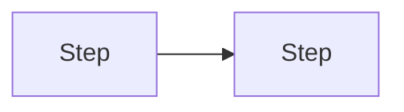

## Agent guardrails (read first)

- **Stop and ask the user** if requirements conflict, specs are ambiguous, or the next step needs **substantial unplanned design** (new public surfaces, broad refactors) not covered here or in linked zettels/ADRs.
- **Do not** expand scope silently or guess intent. When in doubt, **ask** and quote the unclear passage.
- **Prefer** small, reviewable steps. If review is on, halt at the boundaries in **Review policy**.

## Review policy

- **Stop after each todo / milestone**: yes / no
- **Who validates**: user / tests / both

## Scope

- **In scope**: …
- **Design links**: [[hub-or-topic]], ADRs (e.g. D-NNN), …

### Out of scope (planned non-goals)

Items **never** targeted by this plan — not "later", just not this phase's goals.

- …

### Deferred work (postponed during implementation)

Items that were **in scope or surfaced as needed**, then **intentionally skipped** for now (tech debt, follow-up refactors). Record **why** when non-obvious. May become queue items — **not the same as Out of scope** above.

- …

## Acceptance criteria

Definition of done: behavior, tests, compatibility, or other measurable outcomes.

- …

## Work breakdown

Freeform milestones aligned with the YAML `todos` (add more `milestone-`* todos if the phase needs several implementation steps).

1. …
2. …

## Design notes (optional)

Prefer algorithm sketches, pseudo-code, or short snippets when behavior is easy to misunderstand. Add diagrams (e.g. Mermaid) for dependencies, sequences, or dataflow when they reduce risk.

## Risks, complications, and breaking changes

- **Risks / complications**: edge cases, integration surprises, V2-migration impact.
- **Breaking changes**: surface syntax, snapshots, behavior — list explicitly, or state **none intended**.

## Plan drift (optional)

If execution diverges from this file, bullet **what changed and why** (short paper trail).

## Verification (plan-specific)

Spell out **this phase's** tests and commands (which `pnpm test <path>` files, snapshot updates, `pnpm yap` checks, grammar regeneration). The generic close-out lives in the create-plan skill.

- …

## Close-out

1. **Mechanical checklist** — per the create-plan + zettelkasten skills: queue `[x]`, `z-yap/thread.md` session block, session zettel when warranted, `connections.md`, zettel status/tags, `scripts/adrs.js` if new ADRs.
2. **Zettelkasten reconciliation (before calling the plan done)** — review what shipped (code, tests, behavior) against this plan, acceptance criteria, and Deferred work. Compare to the design space and every zettel the work touched or should have touched. **Call out discrepancies explicitly** (stale status tags, missing connections, behavior diverging from a zettel, unlinked ADRs); do not silently ignore drift.
3. **New zettels** — list new atomic notes that should exist (surfaced concepts, deferred-work captures, hub splits). **Confirm with the user** which to create (and naming) before adding them.

Add **only non-obvious** mechanical bullets below.

- …

## Design decisions (optional)

- **D-NNN**: …
- Pre-settled (zettels): …

## Appendix: scratch

Optional drafting notes; trim before treating the plan as final.
