<!-- 67483184-49f4-449a-9acb-75b28561bace -->
---
todos:
  - id: "setup-zettels"
    content: "Create z-yap/resources/plans directory, write plan file, create implementation zettel and queue zettel with plan refs and hub links"
    status: pending
  - id: "milestone-1-constructor"
    content: "Add Bubble to EB.Term union, Constructors.Bubble, Patterns.Bubble in term.ts and lowering/patterns.ts"
    status: pending
  - id: "milestone-2-shift"
    content: "Update shift.ts to produce Bubble instead of Var(skolem); design nondeterminism.solution → Bubble.values injection"
    status: pending
  - id: "milestone-3-traversals"
    content: "Add Bubble cases to all 8 traversal passes (evaluation, verification, pretty, metas, GRAM, lowering, freevars, generalization)"
    status: pending
  - id: "milestone-4-cleanup"
    content: "Remove state.skolems from MutState and all call sites (evaluate, generalize, replay, display contexts, tests)"
    status: pending
  - id: "milestone-5-tests"
    content: "Run full test suite, update snapshots, verify no regressions"
    status: pending
  - id: "milestone-6-audit"
    content: "Spawn reviewer subagent to audit all changed files against project guidelines; fix or surface issues"
    status: pending
  - id: "paper-trail-close-out"
    content: "Update bubble-semantics zettel, thread.md session block, connections.md, reconcile graph vs reality"
    status: pending
isProject: false
---
# Bubble Semantics — Implementation Plan

## Agent guardrails

- **Read before coding**: Load `AGENTS.md`, `.github/copilot-instructions.md`, `.cursor/rules/*.mdc`, and `~/.config/ai-agents/` at session start. These are the style and behavior contracts — follow them, don't duplicate their content.
- **Stop on ambiguity**: If any interaction between Bubble and the existing skolem/nondeterminism machinery is unclear, stop and surface the issue. Do not guess.
- **Stepwise review**: Pause after each milestone for user review before proceeding.
- **No bulk zettel creation**: Confirm with user before creating new zettels beyond the implementation/queue pair.

## Review policy

Pause after each todo milestone. The user will confirm before the next step begins.

## Scope

Add `Bubble` as a new `EB.Term` constructor that carries shift information at the use site:

```typescript
{ type: "Bubble"; id: number; ann: NF.Value; values: NF.Value[]; shift: Term }
```

This replaces the current indirection where `shift.ts` returns `Var(skolem)` and stashes `Shift(body)` in `state.skolems[skolem.val]`.

**Design zettels**: `[[bubble-semantics]]`, `[[shift-reset-verification]]`, `[[shift-reset-verification-stub]]`

**Thread**: `[[delimited-continuations.thread]]`

## Out of scope

- Full shift/reset verification (part 2 — `[[shift-reset-verification]]`). Verification emits `NF.Any + true` for Bubble, same as the current stub.
- Open shift verification (`[[open-shift-verification]]`)
- Any changes to the NbE evaluation semantics of Shift/Reset (stack capture, delimiter, continuation)

## Deferred work

- **ST monad / stateful mutation for Bubble.values**: Option B (resume writes directly into Bubble) could avoid the post-processing injection pass. Deferred as part of a broader elaboration monad refactor — the current monad (`V2.Do`) is generator-based and doesn't support backtracking mutation cleanly.

## Acceptance criteria

1. `EB.Term` has a `Bubble` constructor with `id`, `ann`, `values`, `shift` fields
2. `shift.ts` produces `Bubble(...)` instead of `Var(skolem)` + `state.skolems` stash
3. All 8 traversal passes handle `Bubble` correctly
4. `state.skolems` map is removed from `MutState`
5. `skolems` parameter removed from `evaluate()`, `generalize()`, `replay()`, display contexts
6. `nondeterminism.solution` values move into `Bubble.values` (populated by `resume`)
7. All existing tests pass (shift-reset, integration, elaboration, lowering, verification)
8. Pretty-prints as `bubble#N` instead of `?N`

## Work breakdown

### Milestone 1: EB.Term constructor and pattern

**Files**:
- [src/elaboration/syntax/term.ts](src/elaboration/syntax/term.ts) — Add `Bubble` to `Constructor` union, add `Constructors.Bubble(...)`, add `Patterns.Bubble` pattern object
- [src/lowering/patterns.ts](src/lowering/patterns.ts) — Add `Bubble` pattern

The new constructor sits alongside `Reset` and `Shift` in the union:

```typescript
| { type: "Bubble"; id: number; ann: NF.Value; values: NF.Value[]; shift: Term }
```

### Milestone 2: shift.ts — produce Bubble

**File**: [src/elaboration/inference/shift.ts](src/elaboration/inference/shift.ts)

Current flow (lines 36-60):
1. Creates skolem meta, returns `Var(skolem)` as elaborated term
2. Builds `Shift(body)` and stashes in `state.skolems[skolem.val]`
3. `resume` accumulates values in `state.nondeterminism.solution[meta.val]`

New flow:
1. Still creates the skolem meta for typing (the meta variable is needed for unification — `A` is the inferred shift type)
2. Checks the shift body as before
3. Instead of stashing, constructs `Bubble(skolem.val, A, [], body)` — values start empty
4. `resume` still accumulates values via `nondeterminism.solution`
5. At let-boundary replay time, values are injected into the Bubble

**Key subtlety — nondeterminism replay**: The `replay` function in [src/elaboration/solver/nondeterminism.ts](src/elaboration/solver/nondeterminism.ts) generates multiple elaboration runs from `nondeterminism.solution`. Currently it threads `skolems` through. With Bubble, the replay mechanism needs to populate `Bubble.values` from the solution map. Two approaches:

**Decision: Option A** — Keep `nondeterminism.solution` as accumulator during elaboration, then inject values into Bubble at replay/zonking time (a post-processing pass on the elaborated term). This is cleaner (immutable term construction) and aligns with the existing pattern where replay produces zonker maps. The Bubble's `values` field would be populated during the same zonking/substitution pass that resolves other metas.

**Future optimization note**: A stateful mutation approach (ST monad or similar) could avoid the post-processing pass by having `resume` write directly into the Bubble node. This is deferred as part of a broader elaboration monad refactor — not in scope for this plan.

### Milestone 3: Update traversal passes (8 files)

Each pass needs a `.with({ type: "Bubble" }, ...)` case:

| File | Current behavior | Bubble case |
|------|-----------------|-------------|
| [evaluation.v2.ts](src/elaboration/normalization/evaluation.v2.ts) | `Var(Meta)` → lookup `skolems` → eval `Shift` | `Bubble` → eval `bubble.shift` (same Shift logic) |
| [synth.ts](src/verification/V2/synth.ts) | `Shift` → `NF.Any + true` | `Bubble` → same stub |
| [pretty.ts](src/elaboration/pretty/pretty.ts) | `Var(Meta)` with skolems check | `Bubble` → `"bubble#" + id` |
| [metas.ts](src/elaboration/shared/metas.ts) | `Shift` → recurse body | `Bubble` → recurse `shift` field |
| [translate.ts](src/GRAM/translate.ts) | `Shift` → emit shift node | `Bubble` → delegate to `shift()` |
| [lower.ts](src/lowering/lower.ts) | `Shift` → `Continuation.Shift.lower` | `Bubble` → delegate same |
| [freevars.ts](src/lowering/shared/freevars.ts) | `Shift` → recurse body | `Bubble` → recurse `shift` field |
| [generalization.ts](src/elaboration/normalization/generalization.ts) | Filters `skolems[m.val]` | Filter `m.val` matching any Bubble id instead |

### Milestone 4: Remove skolem plumbing

**Files to clean up**:
- [monad.v2.ts](src/elaboration/shared/monad.v2.ts) — Remove `skolems` from `MutState`, remove from `initialState`
- [evaluation.v2.ts](src/elaboration/normalization/evaluation.v2.ts) — Remove `skolems` parameter from `evaluate()` and `evaluateTerm()`; remove `Var(Meta)` → skolems lookup branch
- [generalization.ts](src/elaboration/normalization/generalization.ts) — Remove `skolems` parameter from `generalize()`
- [nondeterminism.ts](src/elaboration/solver/nondeterminism.ts) — Remove `skolems` parameter from `replay()` callback signature
- [statements.ts](src/elaboration/inference/statements.ts) — Remove `skolems` from `_letdec` and `replay` calls
- [module.ts](src/elaboration/module.ts) — Remove `skolems` from `ElaborationDebug`, remove from `generalize` calls
- [pretty.ts](src/elaboration/pretty/pretty.ts) — Remove `skolems` from `DisplayContext`, remove the `ctx.skolems` check in Meta display
- [util.ts](src/elaboration/inference/__tests__/util.ts) — Remove `skolems` from display context
- [utils.ts](src/elaboration/__tests__/utils.ts) — Remove `skolems` from display/state
- [evaluation.v2.test.ts](src/elaboration/normalization/__tests__/evaluation.v2.test.ts) — Remove `skolems` from `evaluate` calls

### Milestone 5: Tests and verification

- All existing shift-reset tests in [shift-reset.test.ts](src/elaboration/inference/__tests__/shift-reset.test.ts) must pass
- Integration tests (56 tests across 13 files) must pass
- Elaboration tests (199 tests) must pass
- GRAM tests (10 test files in `src/GRAM/__tests__/`) must pass — this is the active lowering path
- Verification tests (114 tests) must pass
- Snapshot updates expected for shift-containing elaboration output (Bubble display vs Meta display)

**Note on lowering tests**: `src/lowering/__tests__/` tests the deprecated Core -> MIR direct lowering path. These should not crash (add a Bubble case in `lower.ts` and `freevars.ts`), but they are not a validation target. The active path is GRAM-based: `src/GRAM/__tests__/translate.test.ts` and `src/GRAM/__tests__/shift-reset.test.ts`.

### Milestone 6: Style audit

Spawn a reviewer subagent (using the `yap-reviewer` skill at `.cursor/skills/yap-reviewer/SKILL.md`) to audit all files changed during this plan against the project's style contract. The reviewer checks for: type assertions, mutation, else blocks, null usage, loose equality, narration comments, missing provenance, ts-pattern violations, fp-ts misuse. Issues that are simple fixes should be resolved; anything requiring significant rework should be surfaced to the user.

## Design notes

```mermaid
flowchart TD
  subgraph current ["Current: Var(skolem) indirection"]
    ShiftTS1["shift.ts: infer"] --> SkolemMeta["Create skolem meta"]
    SkolemMeta --> VarSkolem["Return Var(skolem)"]
    ShiftTS1 --> ShiftBody1["Build Shift(body)"]
    ShiftBody1 --> Stash["Stash in state.skolems"]
    Resume1["resume"] --> NondetSoln["state.nondeterminism.solution"]
    VarSkolem -->|"evaluate"| EvalLookup["Var(Meta) -> lookup skolems"]
    Stash --> EvalLookup
    EvalLookup --> EvalShift["Evaluate Shift: stack capture"]
    NondetSoln -->|"replay at let boundary"| Replay1["Generate zonker maps"]
  end

  subgraph proposed ["Implemented: Bubble node"]
    ShiftTS2["shift.ts: infer"] --> BubbleMeta["Create meta for type A"]
    ShiftTS2 --> ShiftBody2["Check shift body"]
    Resume2["resume"] --> NondetSoln2["state.nondeterminism.solution"]
    ShiftBody2 --> ReadSoln["Read solution[skolem.val]"]
    NondetSoln2 --> ReadSoln
    ReadSoln --> BubbleNode["Return Bubble(id, ann, values, shift)"]
    BubbleNode -->|"evaluate"| EvalBubble["Evaluate bubble.shift: stack capture"]
  end
```



The Bubble node is self-contained — all information lives at the use site. The skolem meta is still created for typing purposes (the meta variable `A` represents the shift expression's inferred type and participates in unification), but it is no longer used as a term-level representation. The meta's role is purely type-level.

## Risks / breaking changes

- **Snapshot churn**: Shift-containing tests will show `bubble#N` instead of `?N` in pretty output. Expected and benign.
- **Nondeterminism replay interaction**: The replay mechanism currently threads `skolems` and generates multiple zonker maps. With Bubble, values injection must happen at the right point — Option A (post-processing at replay/zonk time) is the chosen approach.
- **Deprecated lowering path**: `src/lowering/` (Core -> MIR direct) is deprecated. Add Bubble cases to avoid crashes but do not treat these tests as validation targets. The active path is GRAM (`src/GRAM/`).
- **GRAM shift-reset pass**: Already has a `bubble` concept internally. The new EB.Term Bubble should align vocabulary but the GRAM pass reads `Shift` nodes in the graph, not EB.Term directly. The `translate.ts` bridge just needs to emit the same graph structure from Bubble as it does from Shift.

## Verification

```bash
pnpm test src/elaboration/inference/__tests__/shift-reset.test.ts
pnpm test src/elaboration/normalization/__tests__/evaluation.v2.test.ts
pnpm test   # full suite — expect snapshot updates
pnpm typecheck
```

## Close-out

Per `[[implementation-plan-workflow.meta]]` (z-piescript convention, adapted for z-yap):
1. Update `[[bubble-semantics]]` zettel: `planned` → `implemented`, update body with implementation details
2. Append session block to `z-yap/thread.md`
3. Update `connections.md` if new edges arise
4. Reconcile: compare code reality to zettel graph, surface discrepancies
5. Confirm with user any new zettels to create

## Drift from plan

Acceptance criterion #6 (populate `Bubble.values` from `nondeterminism.solution`) was not covered by the milestone breakdown. It was described in the Milestone 2 design notes (Option A) and listed as an acceptance criterion, but never assigned a milestone number.

### Attempt 1 — term traversal (reverted)

Initial implementation added `injectBubbleValues` term traversal to `src/elaboration/syntax/term.ts` — a recursive walk populating each Bubble's `values` from `nondeterminism.solution`. Called at let-boundary (`statements.ts`) and expression path (`module.ts`). This violated Yap's architectural principle of avoiding term traversals (the entire env/NbE/zonker design exists to eliminate them). Reverted.

### Attempt 2 — inline at Bubble construction (current)

`nondeterminism.solution[skolem.val]` is already populated by `resume` before `shift.ts` constructs the Bubble. Values are read inline at `Bubble` construction time in `shift.ts`:

```typescript
const { nondeterminism } = yield* V2.getSt();
const values = nondeterminism.solution[skolem.val] ?? [];
const out = EB.Constructors.Bubble(skolem.val, A, values, tm);
```

No post-processing pass needed. The Bubble is born with its values already populated. This aligns with Yap's design: information flows through the monadic state, not through term rewrites.

### Future work — `tell`/`listen` refactor

The current `nondeterminism.solution` is a stateful `Record<number, NF.Value[]>` accumulated via `modifySt`. A cleaner design would use a Writer-like `tell`/`listen` pattern: `resume` tells resumption values, and `shift.ts` listens for them. This would make the data flow explicit in the monad rather than threaded through mutable state. Tracked as tech-debt: `[[tell-listen-resumption-refactor]]`.

## Design decisions

- `[[bubble-semantics]]` — the EB.Term Bubble design
- `[[shift-reset-verification-stub]]` — the current stub that Bubble's verification case preserves
- `[[shift-reset-verification]]` — the future full verification (out of scope for this plan)
