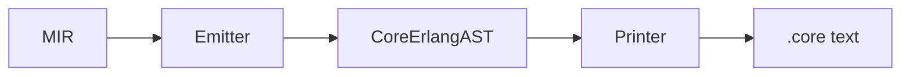

<!-- e9571272-f1fd-474c-9558-183b4979e6a3 -->
---
todos:
  - id: "ast"
    content: "Create src/Codegen/v2/erlang/ast.ts — Core Erlang AST types + constructors"
    status: pending
  - id: "emit"
    content: "Create src/Codegen/v2/erlang/emit.ts — MIR -> Core Erlang AST, using letrec for multi-block"
    status: pending
  - id: "print"
    content: "Create src/Codegen/v2/erlang/print.ts — Core Erlang AST -> .core text"
    status: pending
  - id: "barrel"
    content: "Create src/Codegen/v2/erlang/index.ts barrel export"
    status: pending
  - id: "repl"
    content: "Add erlang to --target flag in cli.ts and repl.ts"
    status: pending
  - id: "snapshot-tests"
    content: "Write snapshot tests for generated Core Erlang output"
    status: pending
  - id: "integration-tests"
    content: "Write erlc compile+run integration tests guarded behind RUN_ERLANG_TESTS"
    status: pending
isProject: false
---
# Erlang/Core Erlang Backend

## Architecture

Same three-layer pattern as JS and C:



Files under `src/Codegen/v2/erlang/`:

- `ast.ts` — Core Erlang AST types + constructors
- `emit.ts` — MIR -> Core Erlang AST
- `print.ts` — Core Erlang AST -> `.core` text
- `index.ts` — barrel export
- `__tests__/emit.test.ts` — snapshot + integration tests

No runtime needed — BEAM stdlib provides maps, BIFs, io, etc.

## Core Erlang AST (`ast.ts`)

Core Erlang is small. The AST needs roughly:

- **Module** — name, exports list, function definitions
- **FunDef** — name/arity, parameter list, body expression
- **Expr**:
  - `Lit` — integer, float, atom, string (char list), nil
  - `Var` — variable (uppercase in Core Erlang)
  - `Let` — `let <Vars> = <Expr> in <Body>`
  - `Letrec` — mutually recursive function defs (for multi-block)
  - `Apply` — `apply Func(Args)` (internal calls)
  - `Call` — `call 'mod':'fun'(Args)` (BIF/stdlib calls)
  - `Case` — `case <Expr> of <Clauses> end`
  - `Tuple` — `{a, b, c}`
  - `Cons` / `Nil` — list construction
  - `Map` — `~{'key' => val}` (OTP 17+, maps in Core Erlang)
  - `Fun` — anonymous function / function reference
- **Clause** — pattern, guard, body (for case arms)
- **Pattern** — literal, variable, tuple, etc.

## MIR -> Core Erlang Mapping (`emit.ts`)

Key mappings:

- **Module** -> `module 'yap_main' ['main'/0]` with all function defs
- **Function (single block)** -> `let` chain + final expression
- **Function (multi block)** -> `letrec` where each block becomes a named function. `Jump(target, args)` becomes `apply 'target'(args)`. BEAM optimizes these as tail calls.
- **Let(name, expr)** -> `let <Name> = <expr> in ...`
- **Alloc(record)** -> `call 'maps':'from_list'([{key, val}, ...])`
- **Read(label, target)** -> `call 'maps':'get'('label', Target)`
- **Update(immutable)** -> `call 'maps':'merge'(Old, New)`
- **Update(fbip)** -> chain of `call 'maps':'put'('key', Val, Map)`
- **Call(direct)** -> `apply Func(Args)` or `call 'Mod':'Fun'(Args)` for FFI
- **Call(indirect)** -> `apply Callee(Args)`
- **FuncRef** -> `fun name/arity`
- **PrimOp** -> `call 'erlang':'+'(A, B)` etc.
- **Branch** -> `case` with clauses matching on atom/string values
- **Return** -> just the expression (last expr in function body)
- **Lit(Num)** -> integer literal
- **Lit(Bool)** -> atoms `'true'` / `'false'`
- **Lit(String)** -> `"hello"` (char list)
- **Lit(Atom)** -> `'name'`
- **Lit(unit)** -> `'nil'`

Variable naming: Core Erlang requires uppercase variables. Sanitize MIR names: `x0` -> `X0`, `env_1` -> `Env_1`, etc.

## Printer (`print.ts`)

Recursive serializer from the Core Erlang AST to `.core` text. Core Erlang has a very regular syntax — no need for an external formatter. The printer handles indentation directly.

Example output for `(lam x. x) 42`:
```erlang
module 'yap_main' ['main'/0]
attributes []
'main'/0 = fun () ->
  let <Env_1> = call 'maps':'from_list'([])
  in let <Fnref_0> = fun 'f_0'/2
    in let <Closure_0> = call 'maps':'from_list'([{'__fn', Fnref_0}, {'__env', Env_1}])
      in let <X0> = 42
        in let <Fnref_1> = call 'maps':'get'('__fn', Closure_0)
          in let <Env_2> = call 'maps':'get'('__env', Closure_0)
            in apply Fnref_1(Env_2, X0)

'f_0'/2 = fun (Env_0, X) -> X
end
```

## REPL integration

- Add `"erlang"` to the `--target` option in [scripts/cli.ts](scripts/cli.ts) (currently `"js" | "c"`)
- Update `ReplOpts.target` type in [src/cli/repl.ts](src/cli/repl.ts) to `"js" | "c" | "erlang"`
- Add `evalCodegenErlang` in repl.ts — emits Core Erlang, displays it (like the C target), returns null
- Prompt: `erlang lambda>`

## Tests (`__tests__/emit.test.ts`)

Same structure as C tests:

- **Snapshot tests** — emit Core Erlang text, snapshot it. Same ~12 test cases as C (literals, arithmetic, identity, curried closure, structs, projection, variant match, shift/reset).
- **Integration tests** — guarded behind `RUN_ERLANG_TESTS` env var. Write `.core` file, `erlc +from_core`, run with `erl -noshell`, capture stdout, assert. Erlang is already installed (`erlc` at `/opt/homebrew/bin/erlc`, v28.0.4).

For integration tests, the entry point should call `io:format("~p~n", [Result])` to print the result to stdout.

## Erlang setup

Already installed — `erlc` and `erl` are on PATH via Homebrew (Erlang 28.0.4). No setup step needed.
