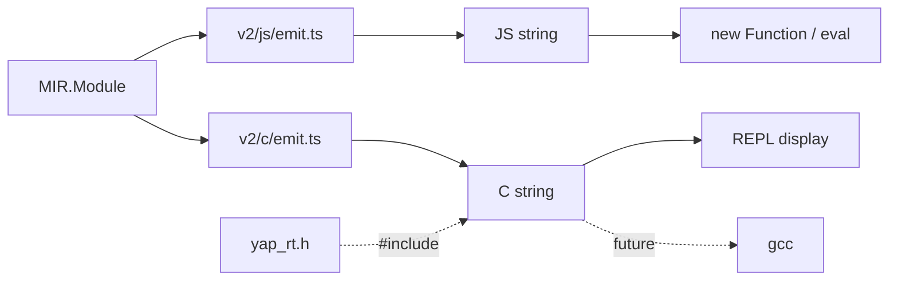

<!-- e9571272-f1fd-474c-9558-183b4979e6a3 -->
---
todos:
  - id: "reorganize"
    content: "Move current JS codegen files into src/Codegen/v2/js/ subfolder, update imports in repl.ts and tests"
    status: pending
  - id: "runtime"
    content: "Write yap_rt.h under src/Codegen/v2/c/rt/: tagged union Value, Record, Closure, arena allocator, constructors, primop helpers, print_value"
    status: pending
  - id: "emitter"
    content: "Implement src/Codegen/v2/c/emit.ts: MIR.Module -> C source string, mirroring JS emitter structure"
    status: pending
  - id: "printer"
    content: "Implement src/Codegen/v2/c/print.ts: optional clang-format wrapper"
    status: pending
  - id: "barrel"
    content: "Create src/Codegen/v2/c/index.ts barrel export"
    status: pending
  - id: "repl-target"
    content: "Add --target=js|c flag to REPL (requires --codegen). JS is default. C target emits code and displays with :set elaboration"
    status: pending
  - id: "snapshot-tests"
    content: "Write snapshot tests for generated C output (same 30 test cases as JS codegen)"
    status: pending
  - id: "integration-tests"
    content: "Write gcc compile+run integration tests guarded behind RUN_C_TESTS env var"
    status: pending
isProject: false
---
# MIR-to-C Code Generator

## 0. Reorganize: move JS codegen into `v2/js/`

Current layout has JS codegen files loose in `src/Codegen/v2/`. Move them into a `js/` subfolder so JS and C are parallel:

```
src/Codegen/v2/
  js/
    js.ts        (was v2/js.ts -- the JS AST types)
    emit.ts      (was v2/emit.ts)
    print.ts     (was v2/print.ts)
    index.ts     (was v2/index.ts)
    __tests__/
      emit.test.ts  (was v2/__tests__/emit.test.ts)
  c/
    rt/yap_rt.h
    emit.ts
    print.ts
    index.ts
    __tests__/
      emit.test.ts
  index.ts       (new top-level barrel: re-exports v2/js and v2/c)
```

Update imports in:
- [src/cli/repl.ts](src/cli/repl.ts) -- `from "../Codegen/v2/emit"` -> `from "../Codegen/v2/js/emit"` (and print)
- [src/Codegen/v2/js/emit.ts](src/Codegen/v2/js/emit.ts) -- internal `./js` import stays the same since `js.ts` moves with it
- Test file -- relative imports stay the same since test moves with the module

## Architecture



## 1. Runtime header: `src/Codegen/v2/c/rt/yap_rt.h`

A single-header C runtime providing the value representation and memory model. Everything the generated C code calls into.

**Value representation** -- tagged union:

```c
typedef enum { VAL_NUM, VAL_BOOL, VAL_STR, VAL_ATOM, VAL_RECORD, VAL_CLOSURE, VAL_NULL } YapTag;

typedef struct YapValue {
    YapTag tag;
    union {
        int64_t num;
        int     b;
        char*   str;
        struct YapRecord*  rec;
        struct YapClosure* cls;
    } data;
} YapValue;
```

**Records** -- flat array of key-value pairs (simple, generic, no per-shape struct generation needed for v1):

```c
typedef struct YapRecord {
    int count;
    struct { const char* key; YapValue val; } fields[];
} YapRecord;
```

With helpers: `yap_alloc_record(n)`, `yap_record_get(rec, key)`, `yap_record_set(rec, key, val)`, `yap_record_copy_with(rec, updates, n_updates)` (for immutable update / spread).

**Closures** -- function pointer + environment:

```c
typedef YapValue (*YapFnPtr)(YapValue* args, int argc);
typedef struct YapClosure {
    YapFnPtr fn;
    YapValue env;
} YapClosure;
```

With helpers: `yap_mk_closure(fn, env)`, `yap_call_closure(cls, args, argc)`.

**Constructors**: `yap_num(n)`, `yap_bool(b)`, `yap_str(s)`, `yap_atom(s)`, `yap_null()`.

**Memory**: Arena allocator. `yap_arena_init()`, `yap_arena_alloc(size)`, `yap_arena_free()`. All `yap_alloc_*` calls use the arena. Simple bump allocator, freed all at once.

**String comparison**: `yap_streq(a, b)` for Branch scrutinee matching (wraps `strcmp`).

**PrimOps**: Inline helpers or macros -- `yap_add(a,b)`, `yap_eq(a,b)`, etc. These unwrap the tagged union, apply the C operator, and re-wrap.

## 2. C emitter: `src/Codegen/v2/c/emit.ts`

Mirrors [src/Codegen/v2/js/emit.ts](src/Codegen/v2/js/emit.ts) structurally. Emits raw C strings (no C AST intermediate -- C formatting is simple enough that `clang-format` or manual indentation suffices).

Key mappings from MIR:

- **Module** -> `#include "yap_rt.h"`, forward declarations for all functions, function definitions, `int main() { yap_arena_init(); YapValue r = yap_main(); print_value(r); yap_arena_free(); }`
- **Function** -> `YapValue fn_name(YapValue arg0, YapValue arg1, ...)`. All params and locals are `YapValue`.
- **Single-block function** -> straight-line C statements
- **Multi-block function** -> `int __block = 0; while(1) { switch(__block) { case 0: ... } }` (integer labels, not strings -- map block labels to int enum)
- **Let(name, Lit(Num(42)))** -> `YapValue name = yap_num(42);`
- **Let(name, Var(x))** -> `YapValue name = x;`
- **Let(name, FuncRef(f))** -> `YapValue name = yap_mk_closure(&f, yap_null());` (bare funcref wraps as closure with null env for uniform calling convention)
- **Let(name, PrimOp($add, [a, b]))** -> `YapValue name = yap_add(a, b);`
- **Alloc({ fields })** -> `YapValue name = yap_alloc_record(n); yap_record_set(&name, "x", v0); ...`
- **Read(label, target, result)** -> `YapValue result = yap_record_get(target, "label");`
- **Update(immutable)** -> `YapValue result = yap_record_copy_with(into, updates, n);`
- **Update(fbip)** -> `yap_record_set(&into, "label", value);` (in-place mutation)
- **Call(direct, func, args)** -> `YapValue result = func(arg0, arg1, ...);` (FFI / direct call)
- **Call(indirect, callee, args)** -> `YapValue result = yap_call_closure(callee, (YapValue[]){arg0, arg1}, argc);`
- **Jump** -> set block params, `__block = target_id; break;` (same as JS)
- **Branch** -> `if (yap_streq(yap_to_str(scrutinee), "value")) { ... break; }` chain (same as JS if/else approach)
- **Return** -> `return value;`

PrimOp mapping (same ops as JS, different C operators):

- `$eq`/`$neq` -> `yap_eq`/`yap_neq` (need value-level equality, not pointer equality)
- `$and`/`$or`/`$not` -> unwrap bool, apply `&&`/`||`/`!`, re-wrap
- `$concat` -> `yap_concat` (arena-allocate new string)
- Arithmetic -> unwrap num, apply operator, re-wrap

## 3. C printer: `src/Codegen/v2/c/print.ts`

Thin wrapper: takes the raw C string from `emit.ts`, optionally runs `clang-format` on it (if available), returns the formatted string. If `clang-format` is not available, returns the raw string as-is.

## 4. Barrel: `src/Codegen/v2/c/index.ts`

Exports `emitC` and `printC`.

## 5. REPL `--target` flag

Add `--target=js|c` option to the `repl` command in [scripts/cli.ts](scripts/cli.ts). Constraints:
- Only valid when `--codegen` is enabled (error/warn otherwise)
- Default is `js`
- `ReplOpts` becomes `{ mir: boolean; codegen: boolean; target: "js" | "c" }`

In [src/cli/repl.ts](src/cli/repl.ts), the `evalCodegen` function dispatches on `target`:
- `"js"` -- existing path: `emit -> printJS -> new Function(code)(...ffi)`, displays result
- `"c"` -- new path: `emitC -> printC`, displays the generated C source (no eval). The C code is always printed to the console (not gated behind `:set elaboration`), since displaying the C output IS the point of this target for now.

Prompt becomes `c λ>` when target is C.

## 6. Tests: `src/Codegen/v2/c/__tests__/emit.test.ts`

**Two tiers:**

**Tier 1 -- Snapshot tests (fast, always run):**
Snapshot the generated C string for each MIR input. Same test cases as [src/Codegen/v2/__tests__/emit.test.ts](src/Codegen/v2/__tests__/emit.test.ts). No gcc needed.

```typescript
it("add(1,2) emits correct C", () => {
    const code = emitC(lowerToMir(EB.DSL.add(EB.DSL.num(1), EB.DSL.num(2))));
    expect(code).toMatchSnapshot();
});
```

**Tier 2 -- Integration tests (compile + run, guarded):**
Shell out to gcc, run the binary, parse stdout. Guarded behind `describe.runIf(process.env.RUN_C_TESTS)` so they don't slow the normal test loop.

```typescript
const compileAndRun = (term: EB.Term): string => {
    const code = emitC(lowerToMir(term));
    const dir = fs.mkdtempSync(path.join(os.tmpdir(), "yap-c-"));
    fs.writeFileSync(path.join(dir, "test.c"), code);
    execSync(`gcc -o ${dir}/test ${dir}/test.c -I${rtDir}`, { stdio: "pipe" });
    return execSync(`${dir}/test`, { encoding: "utf-8" }).trim();
};

it("add(1,2) compiles and returns 3", () => {
    expect(compileAndRun(EB.DSL.add(EB.DSL.num(1), EB.DSL.num(2)))).toBe("3");
});
```

The generated `main()` prints the result using a `print_value(v)` helper from the runtime that outputs a parseable format: numbers as digits, strings as quoted, bools as `true`/`false`, records as JSON-like, closures as `<closure>`.

**Test coverage**: same 30 test cases as the JS codegen tests -- primitives, lambdas/closures, structs/proj/inj, blocks, match (literals, variants, structs), shift/reset, FFI.

For FFI tests: compile a small `.c` FFI stub alongside the generated code (e.g., a `print` function that writes to a file, checked after execution).

## File summary

| File | Purpose |
|---|---|
| `src/Codegen/v2/js/` | JS codegen (moved from `v2/` root) |
| `src/Codegen/v2/c/rt/yap_rt.h` | Single-header C runtime (values, records, closures, arena, primops) |
| `src/Codegen/v2/c/emit.ts` | MIR -> C source string |
| `src/Codegen/v2/c/print.ts` | Optional clang-format wrapper |
| `src/Codegen/v2/c/index.ts` | Barrel export |
| `src/Codegen/v2/c/__tests__/emit.test.ts` | Snapshot + integration tests |
| `scripts/cli.ts` | Add `--target` flag |
| `src/cli/repl.ts` | Dispatch codegen by target, update imports |

## Scope boundaries

- No typed struct generation (generic record representation is sufficient for v1)
- No Boehm GC or refcounting (arena only)
- C target in REPL only displays generated code, does not compile or run it
- FFI is direct C function calls; no dynamic loading
