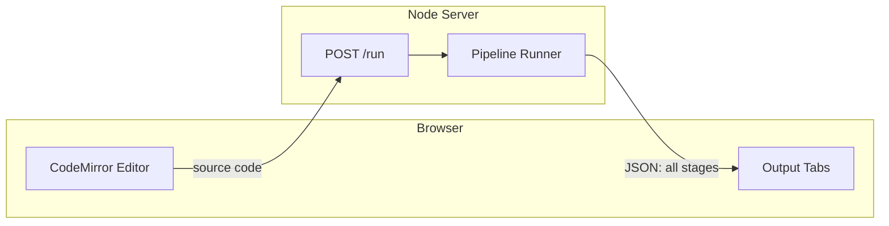

<!-- e9571272-f1fd-474c-9558-183b4979e6a3 -->
---
todos:
  - id: "pipeline-runner"
    content: "Create src/cli/explore/pipeline.ts — pure function that runs all stages and returns PipelineResult"
    status: pending
  - id: "server"
    content: "Create src/cli/explore/server.ts — HTTP server serving index.html and POST /run endpoint"
    status: pending
  - id: "html-ui"
    content: "Create src/cli/explore/index.html — CodeMirror editor + tabbed output panels + de Bruijn toggle"
    status: pending
  - id: "cli-cmd"
    content: "Add `explore` subcommand to scripts/cli.ts"
    status: pending
  - id: "test"
    content: "Manual smoke test: pnpm yap explore, enter code, verify all tabs populate"
    status: pending
  - id: "guideline-audit"
    content: "Audit all new code against repo guidelines (coding-style, pattern-matching, conventions, agent-behavior rules) and refactor any discrepancies"
    status: pending
isProject: false
---
# Pipeline Explorer Dashboard

## Research Summary

Investigated five approaches:

- **Compiler Explorer (Godbolt)** — self-hostable, but extremely heavyweight for a single custom language; designed for comparing compilers, not showing pipeline stages
- **AST Explorer / sxzz fork** — web-based, supports custom parsers, has a PR for multiple split panes, but not designed for multi-stage pipeline display
- **VS Code `TextDocumentContentProvider`** — can create virtual readonly documents that update on-demand; works for side-by-side, but requires building and installing a VS Code extension, doesn't naturally support tabbed multi-output
- **VS Code Custom Editors / Webview** — more powerful but even heavier extension development
- **Simple local web app** — lightweight, purpose-built, zero install friction, natural fit for tabbed outputs

**Recommendation: local web app**, served by `pnpm yap explore`. Fastest to build, no extension install needed, works in any browser, trivially supports tabbed output with de Bruijn toggles. Can later be wrapped in a VS Code webview panel if desired.

## Architecture



**Two modules:**

1. **Pipeline runner** (`src/cli/explore/pipeline.ts`) — pure function: `source string -> PipelineResult` containing all stage outputs as strings. This is the reusable core, independent of any UI.
2. **Web server** (`src/cli/explore/server.ts`) — tiny HTTP server (Node `http` or Hono) serving a single HTML page + a `POST /run` endpoint that calls the pipeline runner and returns JSON.

## Pipeline Runner

A single function in [src/cli/explore/pipeline.ts](src/cli/explore/pipeline.ts):

```typescript
type DeBruijnMode = "off" | "index" | "level" | "both";

type PipelineResult = {
  source: string;
  parsed: string;         // Src.display(term)
  elaborated: string;     // EB.Display.Term(tm, ctx, opts)
  type: string;           // EB.Display.Term(quotedType, ctx, opts)
  normalized: string;     // NF.display(nf, ctx, opts)
  mir: string;            // Pretty.display.module(mod)
  gram: string;           // GRAM.display(graph)
  codegenJS: string;      // printJS(emitJS(mod))
  codegenC: string;       // printC(emitC(mod))
  codegenErlang: string;  // printErl(emitErl(mod))
  errors: string[];
};

function runPipeline(source: string, deBruijn: DeBruijnMode): PipelineResult
```

Each stage is wrapped in try/catch so partial results are returned even if later stages fail. The existing display functions (from the subagent research) already support `{ deBruijn: boolean }` opts for EB and NF printers. For the `"both"` mode, we call the display function twice and interleave or annotate.

Key existing functions to call:
- Parse: `parse(code)` from [src/cli/repl.ts](src/cli/repl.ts) (reuse), then `Src.display(term)` from `@yap/src/pretty`
- Elaborate: `EB.Mod.expression(stmt, ctx)` returns `[tm, ty, us, next]`
- Type display: `EB.NF.display(ty, next, { deBruijn })` — the type is already an `NF.Value`; to show it as an `EB.Term`, use `EB.NF.quote(next.env.length, ty)` then `EB.Display.Term(quoted, next, { deBruijn })`
- Normalize: `EB.NF.evaluate(next, tm)` then `NF.display(nf, next, { deBruijn })`
- MIR: `lowerToMir(tm, declarations)` then `Pretty.display.module(mod)`
- GRAM: `GRAM.translate(tm)` (or from MIR) then `GRAM.display(graph)`
- Codegen: `emitJS/emitC/emitErl` + `printJS/printC/printErl`

## Web UI

A single HTML file ([src/cli/explore/index.html](src/cli/explore/index.html)) with:

- **Left panel**: CodeMirror 6 editor (loaded from CDN: `esm.sh` or `cdn.jsdelivr.net`)
- **Right panel**: tabbed output area with tabs for each pipeline stage
- **Toolbar**: "Run" button (+ Cmd/Ctrl+Enter), de Bruijn toggle (dropdown: Off / Index / Level / Both)
- **Styling**: minimal CSS grid layout, dark theme to match IDE feel

Tabs: Source | Parsed | Elaborated | Type | NF | MIR | GRAM | JS | C | Erlang

Each output tab is a `<pre>` block with monospaced text. No syntax highlighting on outputs initially (can add later with CodeMirror readonly instances).

## Server

[src/cli/explore/server.ts](src/cli/explore/server.ts):

- `GET /` — serves `index.html`
- `POST /run` — accepts `{ source: string, deBruijn: "off"|"index"|"level"|"both" }`, returns `PipelineResult` as JSON
- Uses Node's built-in `http` module (zero dependencies)
- Port: 3333 (configurable)

## CLI Integration

Add `explore` subcommand to [scripts/cli.ts](scripts/cli.ts):

```typescript
program
  .command("explore")
  .description("Open pipeline explorer dashboard")
  .option("-p, --port <number>", "port", "3333")
  .action(cmd => startExplorer({ port: parseInt(cmd.port) }));
```

Run with: `pnpm yap explore` then open `http://localhost:3333`.

## De Bruijn Display

The existing printers already support `{ deBruijn: boolean }`:
- `EB.Display.Term(tm, ctx, { deBruijn: true })` appends `#I<index>` to bound vars
- `NF.display(nf, ctx, { deBruijn: true })` appends `#L<level>` to bound vars

For the "both" mode, we pass `{ deBruijn: true }` to both EB and NF display calls (EB shows indices, NF shows levels). The "index" and "level" modes map to calling the respective display function with `deBruijn: true`. "Off" passes `false` to both.

## Coding Guidelines (apply throughout)

All new code must follow the repo's established standards from `.cursor/rules/`:

- **Immutable, declarative** — no imperative loops, no mutation; prefer recursion, `map`/`reduce`, function composition (`.cursor/rules/coding-style.mdc`)
- **ts-pattern with const pattern objects** — any structural dispatch uses `.with()` patterns, not `if`/`else` chains; define reusable pattern objects when matching repeatedly (`.cursor/rules/pattern-matching.mdc`)
- **Namespace-based APIs** — `Pipeline.run(...)` not `runPipeline(...)`, `Explorer.start(...)` not `startExplorer(...)`; encode functionality in namespace objects (`.cursor/rules/coding-style.mdc`)
- **One-word names, minimal comments** — comments explain "why" not "what"; no narration (`.cursor/rules/coding-style.mdc`)
- **Path aliases** — use `@yap/elaboration/*`, `@yap/src/*`, `@yap/shared/*` (`.cursor/rules/conventions.mdc`)
- **No bloat** — small composable functions, KISS/DRY, avoid unnecessary abstractions

## Final Pass: Guideline Compliance Audit

After implementation and smoke testing, do a full audit of all new files against the rules above. Specifically check for:

- Imperative loops or mutable state that should be declarative
- `if`/`else` chains that should be `match(...).with(...)` dispatches
- Verbose function names that should be namespace-qualified single words
- Comments that narrate "what" instead of "why"
- Direct paths instead of `@yap/*` aliases
- Unnecessary callbacks (`Array.map(x => f(x))` instead of `Array.map(f)`)
- Any deviation from the patterns used in the rest of the codebase

Refactor anything that doesn't conform.

## File Structure

```
src/cli/explore/
  pipeline.ts    — pure pipeline runner function
  server.ts      — HTTP server + static file serving
  index.html     — single-page dashboard UI
  index.ts       — barrel export + startExplorer entry
```
