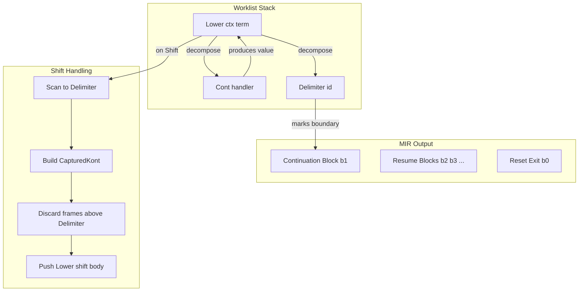

# Shift/Reset Lowering with Multishot Semantics

## Architecture Overview

## Key Design Decisions

1. **Worklist = compiler control** — no recursion; iterative `while (worklist not empty)` loop
2. **CapturedKont = IR data** — `{ resumeStateId, envSnapshot }`; never capture JS closures
3. **Continuation call detection (v1)**: `App(func, arg)` where `func` is `Var(Bound(0))` and we're inside shift body → k-call. Out of scope: `let x = k in x 1`
4. **Block support**: Required for `reset { let x = 1; shift k -> ...; v + x }` — Block lowering pushes Cont frames for each Let/Expr statement

## File Structure

- [src/lowering/delimited_continuation/types.ts](src/lowering/delimited_continuation/types.ts) — `CapturedKont`, `Frame` types
- [src/lowering/lower.ts](src/lowering/lower.ts) — Global worklist, `lowerTerm` dispatch (leaf vs compound), Reset/Shift/Block cases. Extract helper bodies to `delimited_continuation/` if case handlers grow large
- [src/lowering/lower.ts](src/lowering/lower.ts) — Main entry; all cases (Reset, Shift, Block, leaf, compound) live here. Same pattern as [evaluation.v2.ts](src/elaboration/normalization/evaluation.v2.ts): **worklist + result stack**.

## Implementation Plan

### 1. Types ([delimited_continuation/types.ts](src/lowering/delimited_continuation/types.ts))

- **CapturedKont**: `{ resumeStateId: string; envSnapshot: Map<number, string> }` — block label + captured var names (from `ctx.bound`)
- **Frame**:
  - `{ type: "Lower"; ctx: LowerCtx; term: EB.Term }`
  - `{ type: "Cont"; arity: number; handler: (results: LowerResult[]) => void }` — when popped, driver pops `arity` from result stack and calls handler
  - `{ type: "Delimiter"; id: number }`
- Keep existing `ResetCtx` for `resetExit`; extend as needed for worklist integration

### 2. Dynamic k-call index (no pre-scan)

Use `nextResumeIndex: number` in `LowerCtx.shiftBodyCtx`. When we encounter `App(Bound(0), arg)` (k-call), use current `nextResumeIndex` for this jump, then increment. First k-call gets 0, second gets 1, etc. Build the continuation block's Branch incrementally: each time we create a resume block for index i, add case `i -> resumeBlock_i` to a mutable cases array. No extra traversal.

### 3. Worklist + result stack driver (global, in lower.ts)

Follow [evaluation.v2.ts](src/elaboration/normalization/evaluation.v2.ts): global `worklist: Frame[]` and `resultStack: LowerResult[]`.

- **Loop driver**: pop frame. If `Cont`: pop `arity` values from result stack, call `handler(results)`. If `Lower`: call `lowerTerm(ctx, term)`. If `Delimiter`: no-op (marker).
- **Lower (leaf)**: Lit, Var(Bound), Var(Free) — push `LowerResult` onto result stack
- **Lower (compound)**: App, Struct, Lambda, etc. — push `Cont(arity, handler)` then `Lower` frames for subterms. Handler receives results, builds combined result, pushes it onto result stack
- **Lower (Reset)**: push Delimiter, Cont(1, afterReset), Lower(body)
- **Lower (Shift)**: scan to Delimiter, capture, discard frames, push Lower(shift body) with extended ctx
- **Lower (Block)**: push Cont + Lower per statement (like `processStatementsAndPush`)
- **Cont**: Driver pops `arity` from result stack, calls `handler(results)`; handler pushes more frames or pushes final result
- **Delimiter**: No-op (marker only)

### 4. Block and Let lowering

- **Block**: For each statement (Let/Expr), push `Cont(bindX)` then `Lower(value)`. `bindX(result)`: extend ctx, push `Lower(rest)`
- **Let**: Same pattern — push Cont, push Lower(value)
- Integrate with worklist so that when we hit a shift inside a Block, the Cont frames above it encode the "rest of reset"

### 5. Continuation block and resume blocks (multishot structure)

From [multishot.mir](src/lowering/__tests__/multishot.mir):

- **b0 (reset exit)**: `(x8) => return x8`
- **b1 (continuation block)**: `(x1, env_1, i1) => branch i1 { 0 -> b2(x1, env_1) | 1 -> b3(x1, env_1) | ... }` — Branch cases built incrementally as we encounter k-calls (mutable `cases` array)
- **b2, b3, ... (resume blocks)**: Each receives `(value, env)`. Block i: update env with `r{i}: value`, then either `jump b1(nextArg, env', i+1)` (next k-call) or `jump b0(finalResult)` (last resume)

Env record grows: `update-immutable env { r0: x2 }`, then `update-immutable env { r1: x4 }`. Final block reads `r0`, `r1`, computes `+`, jumps to b0.

### 6. k-call lowering (inside shift body)

When we lower `App(func, arg)` and `func` is `Var(Bound(0))` and we're in shift body (ctx has `continuationIndex: 0` or equivalent):

1. Lower `arg` to get value var
2. Get current resume index (incremented per k-call)
3. Emit `jump contBlock(argVar, envRef, resumeIndex)`
4. The continuation block branches to the appropriate resume block

We need to pass "current resume index" and "resume blocks under construction" through the worklist. Option: extend `LowerCtx` with `shiftBodyCtx?: { resumeIndex: number; resumeBlocks: ...; contBlock: string; envRef: string }` when inside shift body.

### 7. Integration: single lower() with worklist

All lowering goes through `lower()` (or `lowerTerm()` as the dispatch). Same pattern as [evaluation.v2.ts](src/elaboration/normalization/evaluation.v2.ts):

- **Entry**: `lowerToMir(term)` pushes `Lower(term, mkCtx())` onto global worklist, runs `while` loop until done
- **Dispatch**: `lowerTerm(ctx, term)` is a big switch/match. Leaf cases return `LowerResult` (caller pops Cont and invokes handler). Compound cases push frames and return (no value).
- **Reset, Shift, Block**: Add cases to the same dispatch; bodies may be large — extract to helpers (e.g. `lowerReset`, `lowerShift`, `lowerBlock`) if needed, but the case entry stays in the main `lower` fn

### 8. LowerCtx extensions

- `continuationIndex?: number` — when inside shift body, index of k in `ctx.bound`
- `resetCtx?: { resetExit: string }` — when inside reset
- `shiftBodyCtx?: { contBlock: string; envRef: string; resumeIndex: number; resumeBlocks: ResumeBlockInfo[] }` — when lowering shift body, for emitting k-calls

### 9. MIR output shape

For `reset { shift k -> (k 1) + (k 2) }`:

- Entry block: alloc env, let x0=1, jump b1(1, env_0, 0)
- b0: return x8
- b1: branch i1 { 0 -> b2 | 1 -> b3 }
- b2: update env with r0, let x3=2, jump b1(2, env_2, 1)
- b3: update env with r1, read r0/r1, add, jump b0(x7)

### 10. Out of scope (document)

- `let x = k in x 1` — k not at bound(0)
- Shift outside reset — throw
- Nested shifts — defer to later iteration

### 11. Deferred (after multishot conts)

- **Match lowering**: Convert to worklist, non-recursive. Currently `lowerMatch` / `lowerMatchFromScrut` use `lowerRecursive` for branch bodies; `compileMatrix` is structurally recursive. Defer until multishot continuations are done.

## Implementation Order

1. Types (Frame, CapturedKont); global worklist; `worklistPush`/`worklistPop` helpers
2. Refactor `lower` into `lowerTerm` dispatch: leaf cases return `LowerResult`, compound cases push frames
3. Add Block case (push Cont per statement, like `processStatementsAndPush`)
4. Add Reset case (push Delimiter, Cont, Lower)
5. Add Shift case (scan to Delimiter, capture, discard, push Lower body); extend ctx with `shiftBodyCtx` (nextResumeIndex, mutable cases)
6. k-call: in App case, detect `func === Var(Bound(0))` + `shiftBodyCtx` present; use `nextResumeIndex`, increment, emit jump, create resume block
7. Wire `lowerToMir` to use worklist; add patterns for Reset, Shift, Block in `patterns.ts`
8. Tests: multishot.mir example, existing lower.test.ts shift/reset cases

---

## Completed (as of 2026-03)

- **Types**: `Frame` (Lower, Cont, Delimiter), `ShiftBodyCtx` (contBlock, envRef, kRef, resumeIndex, resumeBlocks), `ResumeBlockInfo` (label, index, body)
- **Worklist + result stack**: Global `worklist` and `resultStack`; `Delimiter` has `resultSize` for splice
- **Block**: `processStatementsAndPush` for Let/Expression; `lowerBlockRecursive` for sync use
- **Reset**: Pushes Delimiter, Cont(1), Lower(body)
- **Shift**: Finds Delimiter, splices worklist/result stack, builds blocks (entry, shift_body, reset_exit, L_cont), lowers body with `shiftBodyCtx`
- **k-call**: App case when `func === Var(Bound(0))` + `shiftBodyCtx` → emit `Read("__env", kRef, envRef)` + `Jump(contBlock, [arg, env, index])`; `kCallIndex` on result
- **Multishot**: Branch on index; resume blocks with `r0`, `r1`, … env updates; prim handler fills `ResumeBlockInfo.body` when combining k-call results (e.g. `(k 1) + (k 2)`)
- **Tests**: 31 lowering tests pass; multishot test `reset(shift k -> (k 1) + (k 2))` matches `multishot.mir` structure

## Remaining (from original plan)

| Item                                     | Status   | Notes                                                                                                                                                                                                                                  |
| ---------------------------------------- | -------- | -------------------------------------------------------------------------------------------------------------------------------------------------------------------------------------------------------------------------------------- |
| **Block + Shift with captured vars**     | Pending  | For `let x=1; shift k->k 10; x+100`: capture vars in env, allocate env with captured values in entry block, lower return term in continuation block. Current tests pass but may not fully exercise captured vars in continuation body. |
| Delimiter `resumeStateId` → `resultSize` | Done     | Plan said `resumeStateId`; we use `resultSize` for splice                                                                                                                                                                              |
| CapturedKont `envSnapshot`               | N/A      | `CapturedKont` in types.ts; impl uses `ShiftBodyCtx` + `ResumeBlockInfo`; env passed via Jump args                                                                                                                                     |
| Match lowering to worklist               | Deferred | Per §11                                                                                                                                                                                                                                |
