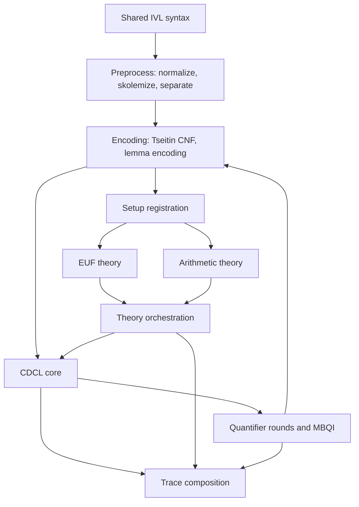

<!-- f093a294-7950-4037-b562-eb4efc4286f0 -->
---
todos:
  - id: "phase-1-preprocess-encoding"
    content: "Port v2 normalization, skolemization, separation, Tseitin/CNF, and lemma encoding, then audit and stop."
    status: implemented
  - id: "phase-2-cdcl"
    content: "Port no-theory CDCL search, BCP, conflict analysis, and backjumping, then audit and stop."
    status: implemented
  - id: "phase-3-euf"
    content: "Port setup registration and EUF congruence closure integration, then audit and stop."
    status: implemented
  - id: "phase-4-arithmetic"
    content: "Port arithmetic rational, normalization, bounds, simplex, and theory facade, then audit and stop."
    status: implemented
  - id: "phase-5-theory"
    content: "Wire CDCL to the concrete theory bundle, then audit and stop."
    status: implemented
  - id: "phase-6-quantifiers"
    content: "Port trigger extraction, E-matching, quantifier engine, and MBQI, then audit and stop."
    status: implemented
  - id: "phase-7-api-trace"
    content: "Add v2 solver API and trace print/replay, then audit and stop."
    status: implemented
isProject: false
---
# Solver V2 Algorithm Port Plan

## Scope And Assumptions

Port the existing working solver algorithms into [`src/verification/solver/v2`](src/verification/solver/v2) without replacing the current solver entrypoints until the v2 path is validated. I’m assuming “CSCL” means the CDCL solver core.

The migration should remain additive and phase-gated. After each phase: run targeted validation, run the audit pipeline, apply only accepted remediation, then stop for review before proceeding.

## Guideline Contract

Apply the same rules used for the scaffold:

- Keep v2 domain-owned types; import shared IVL syntax from [`src/verification/solver/ivl`](src/verification/solver/ivl), not old solver implementation types.
- Organize by domain concern, not technical buckets. Avoid catch-all `types.ts`/`state.ts` files unless scoped inside one domain directory.
- Use namespace APIs: `Clause.add`, `Trail.assign`, `Theory.enter`, `EUF.CC.merge`, `Quantifier.round`.
- Keep trace events owned by the emitting component; [`src/verification/solver/v2/trace.ts`](src/verification/solver/v2/trace.ts) only composes/writes events.
- Use the v2 `Core.Do` monad for orchestration; pure algorithms can remain pure helpers within their domain.
- Preserve controlled ST-style mutation only inside the `Do` interpreter or explicitly owned performance hotspots.
- Use `ts-pattern` pattern objects for structural dispatch. Avoid `if`/`else` chains for ADT dispatch.

## Target Layout

Create domain directories as algorithms land, keeping existing flat files as compatibility/re-export shims until the shape stabilizes:

```text
src/verification/solver/v2/
  preprocess/
    normalize.ts
    skolem.ts
    separate.ts
  encoding/
    tseitin.ts
    lemma.ts
    keys.ts
  cdcl/
    bcp.ts
    search.ts
    analyze.ts
  euf/
    cc.ts
    intern.ts
  arithmetic/
    rational.ts
    normalize.ts
    bounds.ts
    simplex.ts
    theory.ts
  theory/
    orchestrate.ts
  quantifier/
    triggers.ts
    ematch.ts
    engine.ts
    mbqi.ts
  trace/
    print.ts
    replay.ts
```



## Phase 1: Preprocess And Encoding

Status: Implemented.

Port pure preprocessing and encoding first because they have the fewest dependencies.

Source modules:
- [`src/verification/solver/normalize.ts`](src/verification/solver/normalize.ts)
- [`src/verification/solver/skolem.ts`](src/verification/solver/skolem.ts)
- [`src/verification/solver/cnf.ts`](src/verification/solver/cnf.ts)
- `separate` and `encodeLemma` logic from [`src/verification/solver/solver.ts`](src/verification/solver/solver.ts)

Targets:
- [`src/verification/solver/v2/preprocess/normalize.ts`](src/verification/solver/v2/preprocess/normalize.ts)
- [`src/verification/solver/v2/preprocess/skolem.ts`](src/verification/solver/v2/preprocess/skolem.ts)
- [`src/verification/solver/v2/preprocess/separate.ts`](src/verification/solver/v2/preprocess/separate.ts)
- [`src/verification/solver/v2/encoding/tseitin.ts`](src/verification/solver/v2/encoding/tseitin.ts)
- [`src/verification/solver/v2/encoding/lemma.ts`](src/verification/solver/v2/encoding/lemma.ts)
- [`src/verification/solver/v2/encoding/keys.ts`](src/verification/solver/v2/encoding/keys.ts)

Validation:
- Port or mirror focused tests from [`src/verification/solver/__tests__/normalize.test.ts`](src/verification/solver/__tests__/normalize.test.ts) and [`src/verification/solver/__tests__/cnf.test.ts`](src/verification/solver/__tests__/cnf.test.ts).
- Run only targeted v2 tests plus `pnpm typecheck`.

Audit gate:
- Subagent 1: discrepancy finder over changed v2 files.
- Subagent 2: holistic judge deciding what to fix now.
- Subagent 3: apply approved remediation only.
- Stop for review.

## Implementation Drift

Phase 1 was implemented with the following drift from the original plan. The original plan above is preserved as written; this section records the reviewed implementation shape.

- `src/verification/solver/v2/preprocess/` landed as `src/verification/solver/v2/formulas/`.
- `src/verification/solver/v2/encoding/tseitin.ts` landed as `src/verification/solver/v2/encoding/cnf.ts`.
- `src/verification/solver/v2/encoding/lemma.ts` was renamed to `src/verification/solver/v2/encoding/lookup.ts` because it looks up existing Boolean-abstraction literals; it does not construct lemmas or extend CNF.
- Consumers use `CNF.encode(...)`; `Tseitin` remains internal to `encoding/cnf.ts`.
- Tests are colocated with the code they cover:
  - `src/verification/solver/v2/formulas/__tests__/normalize.test.ts`
  - `src/verification/solver/v2/formulas/__tests__/skolem.test.ts`
  - `src/verification/solver/v2/formulas/__tests__/separate.test.ts`
  - `src/verification/solver/v2/formulas/__tests__/formulas.test.ts`
  - `src/verification/solver/v2/encoding/__tests__/cnf.test.ts`
  - `src/verification/solver/v2/encoding/__tests__/lookup.test.ts`
- Validation completed for the implemented v2 surface:
  - `pnpm typecheck`
  - `pnpm test "src/verification/solver/v2"`
- Coverage notes:
  - v2 `normalize` covers the same cases as v1 `src/verification/solver/__tests__/normalize.test.ts`.
  - v2 `CNF` covers the same cases as v1 `src/verification/solver/__tests__/cnf.test.ts`.
  - v2 adds direct tests for skolemization, formula separation, the formula pipeline wrapper, and abstraction lookup.
- Phase 2 CDCL was implemented under `src/verification/solver/v2/cdcl/`:
  - `model.ts` owns the CDCL domain model that was previously in flat `src/verification/solver/v2/cdcl.ts`.
  - `bcp.ts` implements scan-based Boolean Constraint Propagation.
  - `analyze.ts` implements conflict analysis and learned-clause construction.
  - `search.ts` implements no-theory CDCL search through `Core.Do` and `Trace.emit`.
  - `index.ts` preserves `./cdcl` imports as the CDCL entry point.
- Phase 2 intentionally did not add watched literals, theory integration, or trace formatting.
- v2 CDCL tests mirror v1 CDCL behavior, except the v1 `Trace.format` assertion is represented as event-stream collection because v2 trace presentation is Phase 7 work.
- Validation completed for Phase 2:
  - `pnpm typecheck`
  - `pnpm test src/verification/solver/v2/cdcl/__tests__/cdcl.test.ts`
  - `pnpm test src/verification/solver/v2`
- Phase 3 EUF/setup was implemented under `src/verification/solver/v2/euf/` and `src/verification/solver/v2/theory/`:
  - `euf/intern.ts` owns hash-consing and IVL term interning.
  - `euf/cc.ts` owns persistent congruence closure state, equality registration, disequality conflicts, explanations, and stack push/pop.
  - `theory/orchestrate.ts` owns CNF atom registration into EUF and exposes flat module APIs (`setup`, `install`, `assert`, `check`, `enter`, `backtrack`) so consumers write `Theory.setup(...)` after `import * as Theory`.
  - `Arena` remains the state/type name used by `Core.State.arena`; `Intern` is the operation API.
  - Phase 3 intentionally does not wire CDCL search to concrete theories; that remains Phase 5.
- Validation completed for Phase 3:
  - `pnpm typecheck`
  - `pnpm test src/verification/solver/v2/euf`
  - `pnpm test src/verification/solver/v2/theory`
  - `pnpm test src/verification/solver/v2`
- Phase 4 arithmetic was implemented under `src/verification/solver/v2/arithmetic/`:
  - `rational.ts` owns exact rational arithmetic.
  - `normalize.ts` owns IVL atom to linear constraint normalization.
  - `simplex.ts` owns the tableau, bounds, and dual-simplex feasibility check.
  - `bounds.ts` maps Boolean literals to simplex bound assertions.
  - `theory.ts` owns arithmetic state registration, assert/check, and push/pop.
  - `arithmetic.ts` remains a facade over the domain directory.
- Phase 4 theory-boundary integration was added to `theory/orchestrate.ts`:
  - `=` and `!=` register in both EUF and arithmetic, matching v1 behavior.
  - `<`, `<=`, `>`, and `>=` register only in arithmetic.
  - Full CDCL(T) search-loop wiring remains Phase 5.
- Validation completed for Phase 4:
  - `pnpm typecheck`
  - `pnpm test src/verification/solver/v2/arithmetic`
  - `pnpm test src/verification/solver/v2/theory`
  - `pnpm test src/verification/solver/v2`
- Phase 5 full theory orchestration was implemented in the existing CDCL search loop:
  - `cdcl/search.ts` now asserts decisions and unit propagations into `Theory.assert`, checks theory consistency at CDCL fixpoints, and restores the theory stack on conflict backjump.
  - `cdcl/bcp.ts` exposes the scan-based Boolean classifier as the public BCP API for CDCL(T); the older Boolean-only propagator was removed after audit.
  - `euf/cc.ts` imports the CDCL model directly to avoid a facade import cycle introduced by CDCL-to-theory wiring.
  - `theory/__tests__/cdcl.test.ts` adds integration coverage for EUF congruence conflicts, arithmetic bound conflicts, satisfiable arithmetic constraints, and theory trace events.
- Phase 5 intentionally does not consume theory propagations back into the Boolean engine yet; the orchestration types carry propagation payloads, but producing/feeding theory lemmas remains deferred.
- Validation completed for Phase 5:
  - `pnpm typecheck`
  - `pnpm test src/verification/solver/v2/cdcl`
  - `pnpm test src/verification/solver/v2/theory/__tests__/cdcl.test.ts`
  - `pnpm test src/verification/solver/v2`
- Phase 6 quantifiers were implemented under `src/verification/solver/v2/quantifier/`:
  - `model.ts` owns shared quantifier descriptors, state, generated lemma provenance, simplification payloads, and trace event types.
  - `triggers.ts` owns annotated and heuristic trigger extraction from IVL quantifiers.
  - `ematch/matching.ts` owns E-matching over the v2 EUF arena using a supplied representative lookup.
  - `ematch/round.ts` owns trigger-based instantiation rounds, local callback/result types, generation tracking, deduplication keys, and CDCL lemma construction.
  - `mbqi/round.ts`, `mbqi/universe.ts`, `mbqi/candidates.ts`, and `mbqi/grounding.ts` own bounded Model-Based Quantifier Instantiation, its finite term universe, binder candidates, and grounded simplification classification.
  - `quantifier.ts` remains a facade over the domain directory.
- Phase 6 intentionally does not wire quantifier rounds into a v2 top-level solver loop; Phase 7 still owns the v2 solver API, trace presentation/replay, and full quantifier/CDCL loop exposure.
- Validation completed for Phase 6:
  - `pnpm typecheck`
  - `pnpm test src/verification/solver/v2/quantifier`
  - `pnpm test src/verification/solver/v2`
- Phase 7 API and trace presentation were implemented additively:
  - `src/verification/solver/v2/solver.ts` exposes `Solver.create`, `Solver.createTraced`, and `Solver.check` without replacing v1 entrypoints.
  - The v2 solver loop runs the formulas pipeline, CNF encoding, theory installation, CDCL(T), E-matching, and MBQI rounds, then re-runs CDCL with generated quantifier lemmas.
  - `src/verification/solver/v2/trace/print.ts` and `src/verification/solver/v2/trace/replay.ts` provide compact textual trace presentation; this is intentionally lighter than a proof/state replay.
  - `src/verification/solver/v2/euf/cc.ts` now tracks asserted equality/disequality literals so registered-but-unasserted disequality polarities do not cause conflicts during theory checks.
  - `src/verification/solver/v2/__tests__/solver.test.ts` compares v1/v2 results where behavior is shared and documents v2's intended EUF congruence improvement over v1.
  - `src/verification/solver/v2/trace/__tests__/trace.test.ts` checks factual trace output with explicit assertions instead of snapshots.
- Phase 7 audit drift:
  - The discrepancy pass flagged pre-existing `core.ts` interpreter mutation/config literals, new trace narration headers, test decision-level literals, and the solver fresh-id callback counter.
  - The holistic pass accepted the explicit mutation boundaries (`Core.Do`, public incremental API, fresh-id callback), deferred pre-existing `core.ts` cleanup, and required fixing the new trace headers plus named decision-level constants.
- Validation completed for Phase 7:
  - `pnpm typecheck`
  - `pnpm test src/verification/solver/v2`

## Phase 2: CDCL Core Without Theories

Status: Implemented.

Port boolean search over CNF before theory interaction.

Source modules:
- [`src/verification/solver/cdcl/core.ts`](src/verification/solver/cdcl/core.ts)
- Optionally inspect [`src/verification/solver/cdcl/watched.ts`](src/verification/solver/cdcl/watched.ts), but do not introduce watched literals unless we explicitly choose to make this a performance phase.

Targets:
- [`src/verification/solver/v2/cdcl/bcp.ts`](src/verification/solver/v2/cdcl/bcp.ts)
- [`src/verification/solver/v2/cdcl/search.ts`](src/verification/solver/v2/cdcl/search.ts)
- [`src/verification/solver/v2/cdcl/analyze.ts`](src/verification/solver/v2/cdcl/analyze.ts)

Key design points:
- Use `Core.Do` and `Trace.emit` instead of raw `Generator<Step, Result>`.
- Emit `CDCL.Event` from [`src/verification/solver/v2/cdcl.ts`](src/verification/solver/v2/cdcl.ts).
- Use `Trail.Reason.T`, not `Clause.T | "decision"`.
- Keep theory hooks stubbed or absent in this phase.

Validation:
- Port/mirror [`src/verification/solver/__tests__/cdcl.test.ts`](src/verification/solver/__tests__/cdcl.test.ts) for no-theory SAT/UNSAT behavior.
- Targeted v2 CDCL tests plus `pnpm typecheck`.

Audit gate: same three-subagent audit/remediation pipeline, then stop.

## Phase 3: Setup And EUF Theory

Status: Implemented.

Port term interning, EUF registration, congruence closure, conflict detection, and explanation skeleton.

Source modules:
- [`src/verification/solver/theories/euf/arena.ts`](src/verification/solver/theories/euf/arena.ts)
- [`src/verification/solver/theories/euf/cc.ts`](src/verification/solver/theories/euf/cc.ts)
- `buildSetup`, `intern`, and `internTerms` from [`src/verification/solver/solver.ts`](src/verification/solver/solver.ts)

Targets:
- [`src/verification/solver/v2/euf/cc.ts`](src/verification/solver/v2/euf/cc.ts)
- [`src/verification/solver/v2/euf/intern.ts`](src/verification/solver/v2/euf/intern.ts)
- [`src/verification/solver/v2/theory/orchestrate.ts`](src/verification/solver/v2/theory/orchestrate.ts) for EUF-only assertion/check integration

Validation:
- Add EUF-focused unit tests and CDCL+EUF integration cases.
- Targeted tests plus `pnpm typecheck`.

Audit gate: same audit/remediation pipeline, then stop.

## Phase 4: Arithmetic Theory

Status: Implemented.

Port arithmetic normalization, bounds, rational arithmetic, simplex, and theory-facing assert/check.

Source modules:
- [`src/verification/solver/theories/arithmetic/rational.ts`](src/verification/solver/theories/arithmetic/rational.ts)
- [`src/verification/solver/theories/arithmetic/normalize.ts`](src/verification/solver/theories/arithmetic/normalize.ts)
- [`src/verification/solver/theories/arithmetic/bounds.ts`](src/verification/solver/theories/arithmetic/bounds.ts)
- [`src/verification/solver/theories/arithmetic/simplex.ts`](src/verification/solver/theories/arithmetic/simplex.ts)
- [`src/verification/solver/theories/arithmetic/solver.ts`](src/verification/solver/theories/arithmetic/solver.ts)

Targets:
- [`src/verification/solver/v2/arithmetic/rational.ts`](src/verification/solver/v2/arithmetic/rational.ts)
- [`src/verification/solver/v2/arithmetic/normalize.ts`](src/verification/solver/v2/arithmetic/normalize.ts)
- [`src/verification/solver/v2/arithmetic/bounds.ts`](src/verification/solver/v2/arithmetic/bounds.ts)
- [`src/verification/solver/v2/arithmetic/simplex.ts`](src/verification/solver/v2/arithmetic/simplex.ts)
- [`src/verification/solver/v2/arithmetic/theory.ts`](src/verification/solver/v2/arithmetic/theory.ts)

Validation:
- Port/mirror [`src/verification/solver/__tests__/arithmetic.test.ts`](src/verification/solver/__tests__/arithmetic.test.ts).
- Add CDCL+arithmetic integration tests.
- Targeted tests plus `pnpm typecheck`.

Audit gate: same audit/remediation pipeline, then stop.

## Phase 5: Full Theory Orchestration

Wire CDCL and concrete theories together.

Source modules:
- Theory probing logic in [`src/verification/solver/cdcl/core.ts`](src/verification/solver/cdcl/core.ts)
- Theory interface in [`src/verification/solver/theories/theory.ts`](src/verification/solver/theories/theory.ts)

Targets:
- [`src/verification/solver/v2/theory/orchestrate.ts`](src/verification/solver/v2/theory/orchestrate.ts)
- CDCL hooks in [`src/verification/solver/v2/cdcl/search.ts`](src/verification/solver/v2/cdcl/search.ts)

Key design points:
- CDCL-level operation is `Theory.enter` / `Theory.backtrack` or `Theories.enter` / `Theories.backtrack`.
- Theory-local operation remains `EUF.CC.push/pop` and `Arithmetic.State.push/pop`.
- No bundle-level theory stack.

Validation:
- Port/mirror solver integration tests from [`src/verification/solver/__tests__/solver.test.ts`](src/verification/solver/__tests__/solver.test.ts) for propositional + theory cases.
- Targeted tests plus `pnpm typecheck`.

Audit gate: same audit/remediation pipeline, then stop.

## Phase 6: Quantifiers And MBQI

Port trigger extraction, E-matching, quantifier round orchestration, bounded MBQI, and pure-quantifier path.

Source modules:
- [`src/verification/solver/quantifiers/triggers.ts`](src/verification/solver/quantifiers/triggers.ts)
- [`src/verification/solver/quantifiers/ematch.ts`](src/verification/solver/quantifiers/ematch.ts)
- [`src/verification/solver/quantifiers/solver.ts`](src/verification/solver/quantifiers/solver.ts)
- [`src/verification/solver/quantifiers/mbqi.ts`](src/verification/solver/quantifiers/mbqi.ts)
- Quantifier loop in [`src/verification/solver/solver.ts`](src/verification/solver/solver.ts)

Targets:
- [`src/verification/solver/v2/quantifier/triggers.ts`](src/verification/solver/v2/quantifier/triggers.ts)
- [`src/verification/solver/v2/quantifier/ematch.ts`](src/verification/solver/v2/quantifier/ematch.ts)
- [`src/verification/solver/v2/quantifier/engine.ts`](src/verification/solver/v2/quantifier/engine.ts)
- [`src/verification/solver/v2/quantifier/mbqi.ts`](src/verification/solver/v2/quantifier/mbqi.ts)

Validation:
- Port/mirror [`src/verification/solver/__tests__/quantifier.test.ts`](src/verification/solver/__tests__/quantifier.test.ts).
- Include the MBQI regression cases already added to integration tests.
- Targeted tests plus `pnpm typecheck`.

Audit gate: same audit/remediation pipeline, then stop.

## Phase 7: V2 Solver API And Trace Replay

Only after core behavior works, add a v2 API and trace presentation.

Source modules:
- [`src/verification/solver/solver.ts`](src/verification/solver/solver.ts)
- [`src/verification/solver/trace.ts`](src/verification/solver/trace.ts)

Targets:
- [`src/verification/solver/v2/solver.ts`](src/verification/solver/v2/solver.ts)
- [`src/verification/solver/v2/trace/print.ts`](src/verification/solver/v2/trace/print.ts)
- [`src/verification/solver/v2/trace/replay.ts`](src/verification/solver/v2/trace/replay.ts)

Validation:
- Port/mirror [`src/verification/solver/__tests__/trace.test.ts`](src/verification/solver/__tests__/trace.test.ts).
- Compare v1/v2 results on shared IVL fixtures where possible.
- Targeted tests plus `pnpm typecheck`.

Audit gate: same audit/remediation pipeline, then stop.

## Deferred Work

- Watched literals from [`src/verification/solver/cdcl/watched.ts`](src/verification/solver/cdcl/watched.ts) unless CDCL performance becomes the goal.
- Arithmetic branch-and-bound from [`src/verification/solver/theories/arithmetic/branch.ts`](src/verification/solver/theories/arithmetic/branch.ts), because it is not wired in v1.
- Replacing the current solver entrypoints with v2. Keep v2 additive until the behavior is reviewed.
- Model extraction, which is stubbed in v1.
- Wire the v2 public solver's quantifier limit to `Core.Env.config.maxQuantifierRounds` instead of the current local default.
- Core runtime cleanup: name default config constants and revisit the pre-existing `Core.Do` `Either` short-circuit style in a dedicated core pass.
- Theory conclusions / theory propagation: `EUF.CC.State.conclusions` and the theory `propagations` return shape are scaffolded, but neither EUF nor arithmetic currently produce non-empty conclusions and CDCL currently consumes only conflicts. This is a CDCL(T) strength/performance feature, not an immediate correctness blocker for the fixed Boolean abstraction. It is likely useful for larger QF-EUFLIA-style refinement VCs with disjunctions, path joins, or encoded conditionals, but non-urgent for the common Yap/liquid pattern where negated obligations tend to produce direct theory conflicts from active assumptions.
- Incremental abstraction extension for quantified instances that introduce fresh atoms not present in the initial ground CNF. This is a real SMT completeness improvement, but non-urgent for the liquid-types use case because classic liquid systems are designed around quantifier-free refinement logics and avoid general quantified axioms by construction. References: [Real World LiquidHaskell](https://goto.ucsd.edu/~rjhala/papers/real_world_liquid.pdf) describes QF-EUFLIA refinements; [Liquid Types vs. Floyd-Hoare Logic](https://ucsd-progsys.github.io/liquidhaskell-blog/2019/10/20/why-types.lhs/) explains keeping measures uninterpreted with no quantified axioms; [Efficient E-matching for SMT Solvers](https://leodemoura.github.io/files/ematching.pdf) and [Complete instantiation for quantified formulas in SMT](https://leodemoura.github.io/files/citr09.pdf) describe the general SMT setting where quantifier instantiation feeds new ground instances back into the ground solver.

### Quality Control Backlog

- Audit direct boolean `match(...)` usage. Prefer plain boolean expressions, short-circuiting, or focused helpers when a `match` adds ceremony rather than structural clarity.
- Audit `match(...)` versus short-circuiting `if` checks. Use `ts-pattern` for ADT/structural dispatch, but do not force it onto simple guard-style control flow where an early return or boolean combinator is clearer.
- Remove redundant array-like spreads such as `[...xs]` when `xs` is already an array or when the spread does not protect an ownership boundary.
- Revisit smart/reusable pattern objects. Keep structural patterns centralized and reusable, especially around IVL terms/formulas, CNF atoms, CDCL results, and theory events.
- Design better tracing mechanisms before expanding trace output. This needs a separate design discussion for event ownership, detail granularity, replay format, proof hooks, and performance.
- Refactor repeated immutable updates to use `@yap/utils` update/set helpers where they improve clarity and preserve local invariants.

## Per-Phase Audit Protocol

At the end of every phase:

1. Run targeted tests for that phase and `pnpm typecheck`.
2. Subagent 1: mechanical discrepancy audit over changed v2 files using global and Yap rules.
3. Subagent 2: holistic judgment of what should actually change, preserving Yap philosophy and the phase goal.
4. Subagent 3: apply only approved remediation.
5. Re-run targeted validation.
6. Stop and present results for review before starting the next phase.
